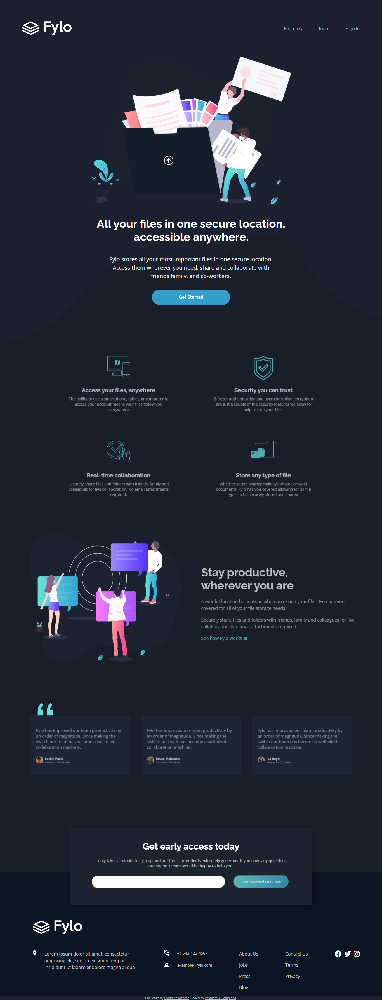

# Frontend Mentor - Fylo dark theme landing page solution

This is a solution to the [Fylo dark theme landing page challenge on Frontend Mentor](https://www.frontendmentor.io/challenges/fylo-dark-theme-landing-page-5ca5f2d21e82137ec91a50fd). Frontend Mentor challenges help you improve your coding skills by building realistic projects. 

## Table of contents

- [Overview](#overview)
  - [The challenge](#the-challenge)
  - [Screenshot](#screenshot)
  - [Links](#links)
- [My process](#my-process)
  - [Built with](#built-with)
  - [What I learned](#what-i-learned)
  - [Continued development](#continued-development)
  - [Useful resources](#useful-resources)
- [Author](#author)
- [Acknowledgments](#acknowledgments)

### The challenge

Users should be able to:

- View the optimal layout for the site depending on their device's screen size
- See hover states for all interactive elements on the page

### Screenshot

I did not include the mobile screenshots since it is very long ahahaa

### Links

Live Site URL: [Live site of the challenge hosted here](https://pikapikamart.github.io/frontendmentor-fylo-dark/)

## My process

Hello, this is my 16th submission here in FEM. I got late in my submission because I took a rest from it for a day or two but i'm back hehe. This challenge was very good in terms of practicing different coding principles. I added some obervers for some touch of animation. Hope you like it ^^

### Built with

- Semantic HTML5 markup
- CSS custom properties
- FlexBox
- Grid
- Sass preprocessor

I said that I won't use any frameworks and build it from scratch to be more exciting and challenging

### What I learned

What I learned in this challenge is that, creating extensible and reusable selectors, classes is very important to minimize things up. It is hard to pinpoint sections, but as you go further, it becomes easier than your previous attempt. 

### Continued development

I want to focus more on creating more complex designs and also designing things on my own time

## Author

- Website - Well I haven't made my profile portfolio, gonna make it sooon when I know a lot of stuffs
- Frontend Mentor - [@pikamart](https://www.frontendmentor.io/profile/pikamart)
- Twitter - [@RaymartPamplona](https://twitter.com/RaymartPamplona)